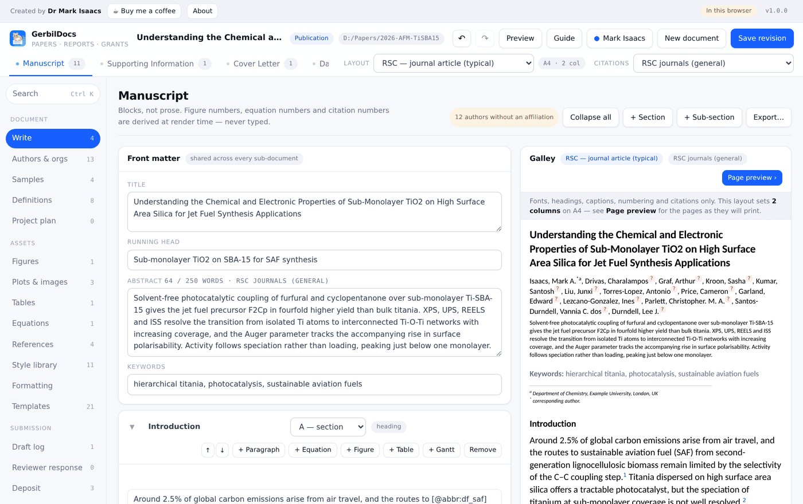
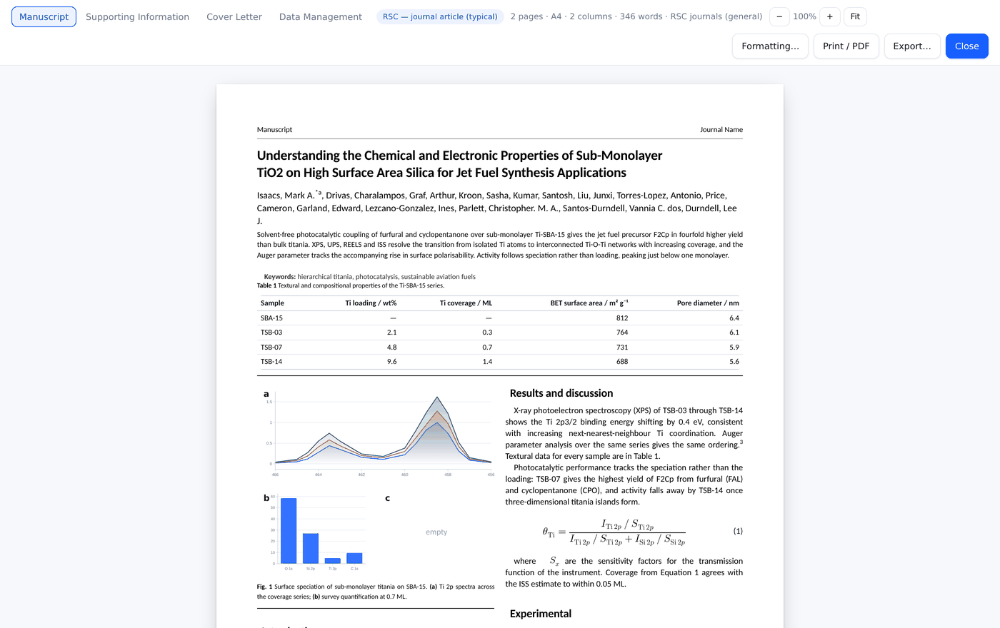
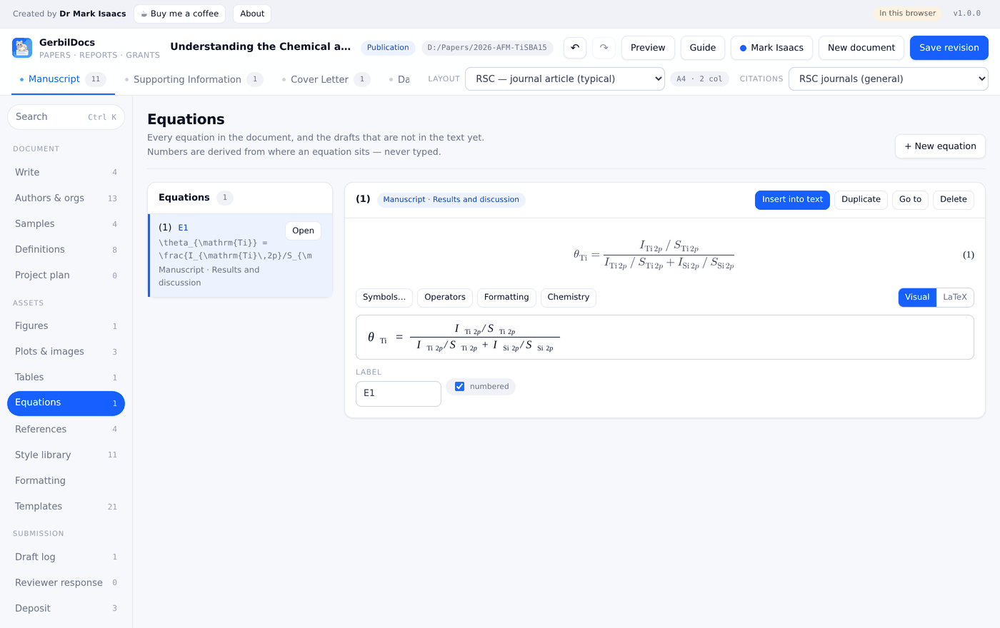
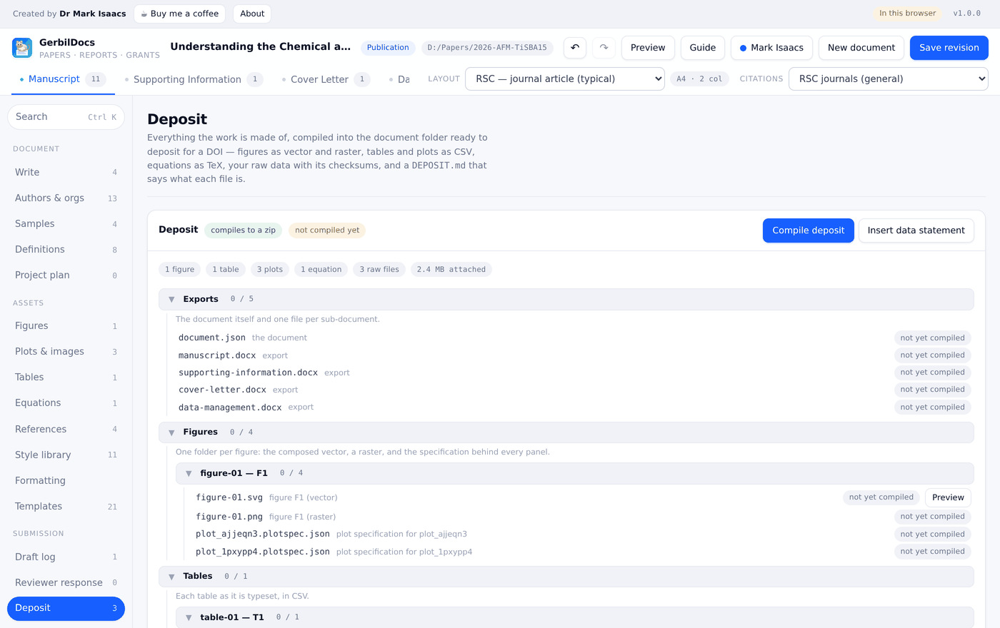

# GerbilDocs

GerbilDocs is a free tool for writing papers, reports and grant applications.
It's built for researchers: everything you reuse — samples, acronyms,
figures, tables, equations, citations, work packages — is referenced by id
rather than typed out by hand, so renaming something rewrites every mention
at once. The preview and the PDF are real pages, with paper size, margins,
columns, headers, footers and page numbers, not a word processor's guess at
what a page will look like.

## Download

The Windows build is a portable zip: download it, unzip it anywhere, and run
`GerbilDocs.exe`. There is no installer and it needs no administrator rights.

Because the build isn't code-signed, Windows SmartScreen will warn on first
run ("Windows protected your PC"). Click **More info**, then **Run anyway**.
This is normal for a small independent application and only appears once.

There's also a single-file HTML build that opens in any modern browser with
no install at all. It stores your documents inside that browser rather than
as files on disk, so it's best for trying GerbilDocs out or writing something
short — for anything you want as a folder you can back up or move, use the
Windows build.

## Screenshots

| | |
|---|---|
|  |  |
| Writing, with the galley beside it | The preview paginates as the PDF will |
|  |  |
| Equations are edited visually, not as LaTeX | The deposit, compiled and ready for a DOI |

## What it does

Writing happens in the Write view, a block-based editor spanning four
sub-documents — manuscript, supporting information, cover letter and data
management plan — that share one set of front matter: title, authors,
organisations, funding. Paragraphs, figures, tables, equations and Gantt
charts are all blocks. Samples, acronyms, figures, tables, equations,
citations and work packages are referenced by id throughout, so a rename
propagates everywhere instead of leaving stale text behind. Inline `@`
references, a command palette (Ctrl+K) and full undo/redo keep the editing
itself out of the way.

Layout is a separate concern from content. The Formatting view controls page
size, columns, justification, hyphenation, every font and colour, caption
numbering and the author block, and a set of built-in layout templates carry
a complete page format in one choice — including submission templates read
off the actual Word templates publishers hand out, for ACS, Science, Wiley,
Nature Communications and RSC, an AVS/AIP REVTeX two-column page, Elsevier,
Physical Review B, an EPSRC case for support, and a plain lab report. The
preview paginates exactly as the PDF will.

Equations have a visual, structural editor rather than requiring LaTeX — a
tabbed symbol picker and operator, formatting and chemistry palettes, with a
LaTeX toggle for anyone who prefers to type it directly — and an Equations
view lists everything placed in the text alongside drafts you haven't placed
yet. Figures support custom row/column grids and half-width text-wrapped
placement; plots come from pasted spreadsheet data with a choice of chart
type. A Project plan view builds aims and objectives, work packages,
milestones and a Gantt chart that inserts into the document as a numbered
figure.

References come from a built-in library with RIS import and several
citation styles. A draft log keeps word-level track changes with per-author
attribution and reviewer-response tooling, so responding to reviewers stays
attached to the document instead of living in a separate file. When a piece
of work is ready to deposit, the Deposit view compiles figures (as SVG and
PNG), tables and plots (as CSV), equations (as TeX), plot specifications
(as JSON) and any attached raw data with checksums into the document folder,
alongside a generated `DEPOSIT.md` describing what each file is — ready to
hand to a repository for a DOI.

## Running from source

```
python -m venv .venv && . .venv/bin/activate      # Windows: .venv\Scripts\activate
pip install -r requirements.txt
python desktop/launch.py
```

Requires Python 3.11. To bundle MathJax so equations render offline, run
once:

```
python tools/fetch_mathjax.py
```

## Building

```
python packaging/build.py --zip
```

This produces the portable Windows bundle. See `packaging/build.py --help`
for the installer and MathJax-fetch options; the reference build runs in
`.github/workflows/build.yml`.

## Your files

Documents live in `Documents\GerbilDocs\<document>\` on your own disk, each
one a plain folder — `document.json` plus `figures/`, `tables/`, `data/` and
`drafts/` — so you can copy, back up or move a document like any other
folder. The application's own vault (your document list, backups, and the
shared library of references, samples, styles and acronyms) lives in
`%APPDATA%\GerbilDocs`, and the shared library is mirrored to readable JSON
there too, so nothing is locked away in a format only GerbilDocs can open.

## Licence

MIT. Copyright (c) 2026 Mark Isaacs. See `LICENSE`.

## Support

GerbilDocs is free. If it's useful to you, you can support its development
at [ko-fi.com/markisaacschem](https://ko-fi.com/markisaacschem).

---

GerbilDocs is developed by one person. Bug reports are welcome.
